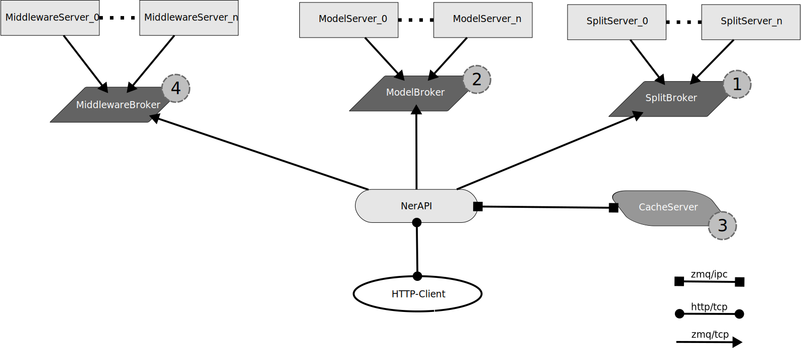
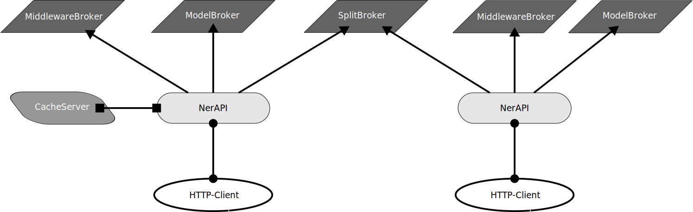
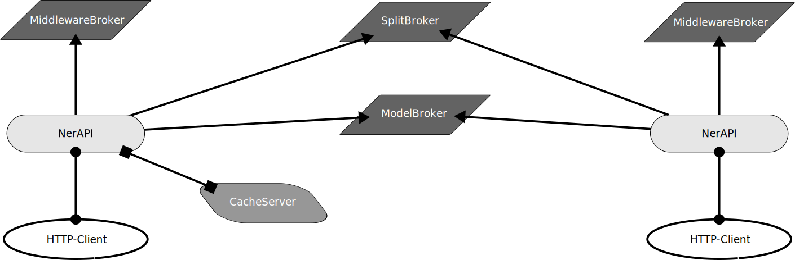

# ner-tagger
a http-api to provide Named-entity recognition for text

# Setup

    git clone https://github.com/banduri/ner-tagger
    cd ner-tagger
    virtualenv .
    source bin/activate
    pip install -r requirements

# size

    (ner-tagger) ~/GITs/ner-tagger >>> du -h -d 1
    52K	./debian
    36K	./ner_tagger
    5.4G	./lib
    184K	./bin
    2.2M	./share
    2.2G	./models
    3.7M	./nltk_data
    2.1M	./.git
    4.0K	./data
    7.6G	.

# debian package

    dpkg-buildpackage -us -uc

# infrastructure

To software consists of
* a http-Frontend-API (NerAPI)
* a modelServer
* a zmqBroker
* an optional cacheServer
* an optional SplitServer
* an optional Middleware Server

The very basic setup is to start the zmqBroker and connect ModelServer and NerAPI to it. 'That will work' but is not that nice since splitting the text into sentences is done by the buildin nltk-package. The postprocessing also happens in the NerAPI-Frontend. Since the cacheserver is missing, all requests will stress the the modelserver. The best results are provided if a cacheserver is used, a splitserver to have better sentencesplits with the spacy package and a middleware-Server to cleanup some of the mess the model produced (also use spacy-package with some NLP-Tasks). The general setup should look like in the following image

1. first the (text-)request is send to the SplitBroker which forwards (with loadbalancing) to all connected SplitServers. The splitup text is then send back to the NerAPI-Frontend. If the SplitBroker is not reachable, or the SplitServers don't reply the text is splitup via nltk on the Frontendserver. 
2. every sentence - one by one - is send to the ModelBroker which forwards (with loadbalancing) to all connected ModelServers. There is no Fallback here if it breaks, it fails hard. The response of the model goes back to the NerAPI-Frontend.
3. before contacting the ModelBroker the cacheServer is queried. If there is already result for that sentence it is returned to the NerAPI-Frontend instead of connecting the ModelBroker. If the ModelBroker was contacted, the result is stored in the cacheServer.
4. after all sentences have been analysed by the Model the data is send to the MiddlewareBroker to process it further and return the desired data to the NerAPI-Frontend, which returns it to the client.

There are other ways to setup the infrastructure. It is also possible to have different Models (including Middleware) connected to different NerAPIs but they are both using the same SplitBroker.

An other possibility is to connect the same ModelBroker and SplitBroker to different NerAPIs and only use different MiddlewareBroker. The cacheServer is designed to be used by one NerAPI only. Also it is possible to connect the cacheServer via tcp.

it is possible to run more then one ModelServer on the same host, while every instance uses a different GPU. It is also possible to run two modelserver on the same GPU which may gives a small speedup. It is still nesecssary to preprocess the data before it is send to the GPU which sill needs CPU processing. It is also possible to setup multiple hosts each running a ModelServer and connecting them to the same ModelBroker. Since the 'slow'-Part is the use of the model there should be no need to setup more http-Workers at the NerAPI-Frontend then ModelServers. 

# Running

    cd ner-tagger
    source bin/activate
    python ./download_and_convert_model_for_local_use.py # only once to download the model and store it for local use
    ./cacheServer.py &
    ./modelServer.py &
    ./zmqBroker.py &
    ./nerapi.py

# api endpoints

## http-frontend

the default API-Endpoint is
    curl http://localhost:8000/api/v1/ner -d '{"text": "die Kinder von Anton Schwarz haben in Dresden eine Wohnung. In dem Buch Traumwerkstadt wird die Wohnung beschrieben."}' -H "Content-Type: application/json"                           
    {"PERSON": ["Anton Schwarz"], "GPE": ["Dresden"], "WORK_OF_ART": ["Traumwerkstadt"]}

the text provided is split into seperate sentences. For every sentence a request to the model is done

    (ner-tagger) ~/GITs/ner-tagger >>> cat data/cache_data.ndjson
    {"die Kinder von Anton Schwarz haben in Dresden eine Wohnung.": {"PERSON": ["Anton Schwarz"], "GPE": ["Dresden"]}}
    {"In dem Buch Traumwerkstadt wird die Wohnung beschrieben.": {"WORK_OF_ART": ["Traumwerkstadt"]}}

Splitting up the text into sentences sometimes yields wrong results. 

    curl http://localhost:8000/api/v1/ner -d '{"text": "die Kinder von Elisabeth II. haben in Dresden eine Wohnung. In dem Buch Traumwerkstadt wird die Wohnung beschrieben."}' -H "Content-Type: application/json"
    {"GPE": ["Dresden"], "WORK_OF_ART": ["Traumwerkstadt"]}

    cat data/cache_data.ndjson
    {"die Kinder von Elisabeth II.": {}}
    {"haben in Dresden eine Wohnung.": {"GPE": ["Dresden"]}}
    {"In dem Buch Traumwerkstadt wird die Wohnung beschrieben.": {"WORK_OF_ART": ["Traumwerkstadt"]}}

the second endpoint does not split, but leads to a general problem with neural networks

    curl http://localhost:8000/api/v1/nernosplit -d '{"text": "die Kinder von Elisabeth II. haben in Dresden eine Wohnung. In dem Buch Traumwerkstadt wird die Wohnung beschrieben."}' -H "Content-Type: application/json"
    {"PERSON": ["Elisabeth II"], "GPE": ["Dresden"]}

    cat data/cache_data.ndjson
    {"die Kinder von Elisabeth II. haben in Dresden eine Wohnung. In dem Buch Traumwerkstadt wird die Wohnung beschrieben.": {"PERSON": ["Elisabeth II"], "GPE": ["Dresden"]}}

    curl http://localhost:8000/api/v1/nernosplit -d '{"text": "die Kinder von Elisabeth II. haben in Dresden eine Wohnung. In dem Buch \"Traumwerkstadt\" wird die Wohnung beschrieben."}' -H "Content-Type: application/json"
    {"PERSON": ["Elisabeth II"], "GPE": ["Dresden"], "WORK_OF_ART": ["\"Traumwerkstadt\""]}

to only get the sentences without any models involved:
    curl http://localhost:8000/api/v1/split -d '{"text": "die Kinder von Elisabeth II. haben in Dresden eine Wohnung. In dem Buch \"Traumwerkstadt\" wird die Wohnung beschrieben."}' -H "Content-Type: application/json"
    {"splits": ["die Kinder von Elisabeth II.", "haben in Dresden eine Wohnung.", "In dem Buch \"Traumwerkstadt\" wird die Wohnung beschrieben."]}

if the 'maxnosplit' value is reached on the nosplit-endpoint, the text will be splitup at sentence bounderies into parts a little smaller then the maxnosplit value.

## Zeromq-endpoints

The cacheserver and the modelserver are used via json-requests.

### cacheserver

    { "cmd" "<store|retrieve>", "key": data, "value": data }

if cmd is 'store' the "key" is used to store "value" data.
if cmd is 'retrieve' the "key" is used to get data.

on cmd='store' '

    {"result": "<ACK|null>", "error": <null|problem>}'

is send to conform or deny cachestoreage. on cmd='retrieve'

    '{"result": <data|null>}, "error": <null|problem>}'

is send. null as a result is a cachemiss. 'key' needs to be a string. From that string a uuid5-string is generated and used as the internal cachekey if anything fails an error not null is returned.

### modelserver

it accepts json in the form:

    { "text" "<text>" }

it returns a json-string with the result of the model-prediction:

    { "result": <data|null>, "error": <msg|null> }

